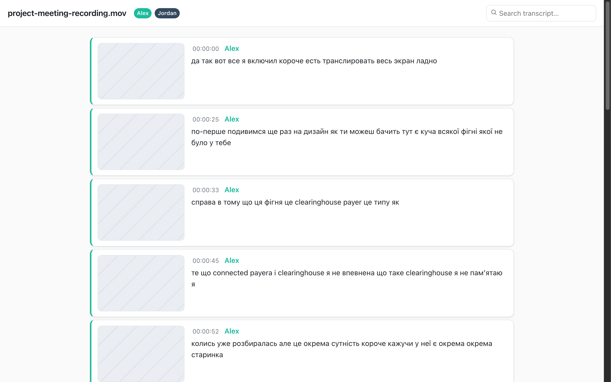
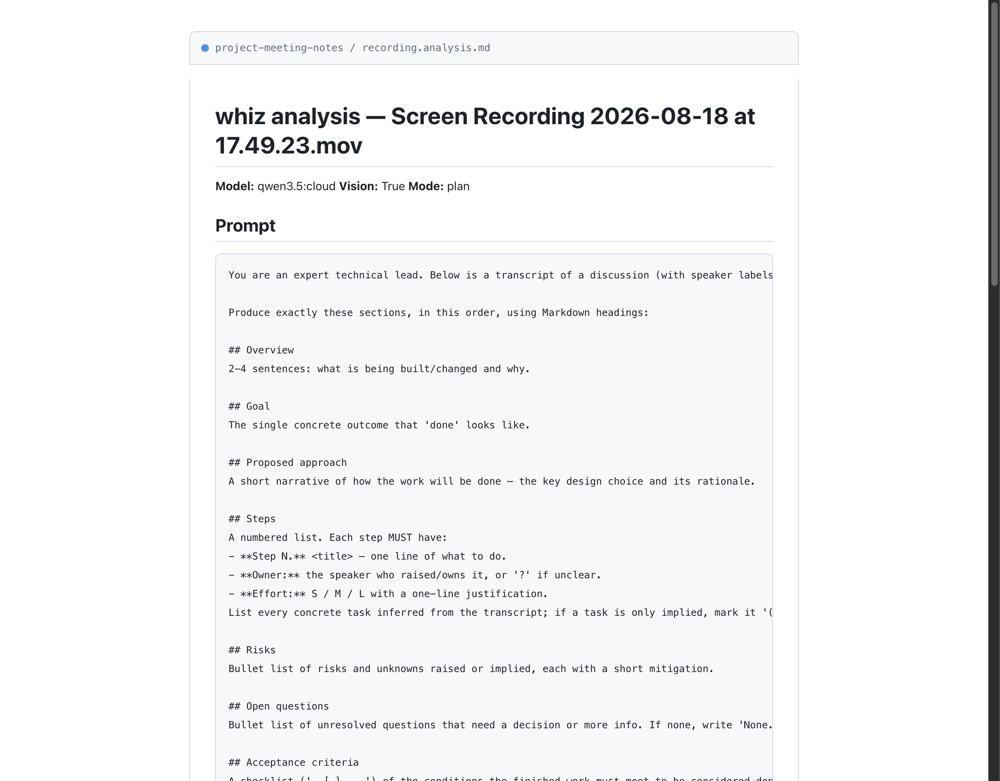

# whiz

[](https://github.com/ReidenXerx/whiz/releases)
[](LICENSE)
[](https://www.python.org/)
[](#requirements)
[](https://github.com/ggerganov/whisper.cpp)

**A transcription CLI for meetings, screen recordings, and interviews — from audio/video to a labeled, named, frame-illustrated transcript in one command.**

```
whiz transcribe recording.mov
```

<p align="center">
  <em>Terminal demo coming soon</em><br>
  
</p>

whiz transcribes, detects who spoke when, prompts you to name each speaker, captures an on-screen frame per segment, and emits a self-contained HTML transcript — all from that single command. Then it can AI-analyze the whole thing (with the frames) and write a concentrated Essentials section you feed back to a later analysis. It's powered by [whisper.cpp](https://github.com/ggerganov/whisper.cpp) for transcription and [sherpa-onnx](https://github.com/k2-fsa/sherpa-onnx) for diarization, with a polished terminal UI built on [rich](https://rich.readthedocs.io).

<p align="center">
  
  <br><br>
  
</p>

---

## Why whiz?

Most transcription tools stop at text. whiz is the one-command path from a screen recording to a **labeled, named, frame-illustrated HTML transcript plus an AI analysis with a concentrated Essentials section** — all local, no server, no API keys required.

- **One command, everything** — transcribe + diarize + name speakers + capture frames + write HTML, automatically.
- **Knows your speakers** — voice profiles save each speaker once you name them; later recordings with the same people are labeled automatically, no flags needed. Profiles even merge across recordings and get more accurate over time.
- **Sees the screen** — auto-enables vision analysis when frames exist and your model is vision-capable. The analyst posture actively reconciles what's visible on screen with what was said, surfacing discrepancies, and treats consecutive frames as a visual timeline (not independent screenshots) so it reasons across the sequence.
- **Made for long videos** — a rolling-context map-reduce keeps each model call focused on a small, coherent window so analysis quality stays high even on hour-long recordings. Zero extra calls.
- **Essentials you feed back** — every analysis appends a dense `## Essentials` bullet list (every fact, decision, number, UI detail) designed as concentrated context for a later `whiz analyze`. No flag, no second file.
- **Local-first & private** — runs entirely on your machine via [Ollama](https://ollama.com) by default. No uploads, no API keys unless you point it at a cloud provider.

## Table of contents

- [Quick start](#quick-start)
- [Requirements](#requirements)
- [Install](#install)
- [What it does](#what-it-does)
- [Recipes](#recipes)
- [Commands](#commands)
- [Configuration](#configuration)
- [Speaker diarization](#speaker-diarization-multi-speaker-labels)
- [Speaker voice profiles](#speaker-voice-profiles-cross-recording-recognition)
- [AI analysis](#ai-analysis-auto-detect-summary-action-items-implementation-plans-vision)
- [Essentials (always on)](#essentials-always-on-concentrated-context-for-a-later-analysis)
- [Testing](#testing)
- [License](#license)

## Quick start

```bash
# Auto-picks the best available model, extracts audio if it's a video,
# and (for video) auto-enables speaker diarization + on-screen screenshots
# + the interactive speaker-naming prompt.
# Writes SRT + JSON + labeled speakers.srt/.txt + frames alongside the input.
whiz transcribe ~/Desktop/recording.mov

# Add a self-contained, frame-illustrated HTML transcript:
whiz transcribe --outputs srt,html recording.mov

# Transcribe + chain straight into AI analysis (one command):
whiz transcribe --analyze recording.mov

# Analyze a prior transcript — auto-detects meeting vs implementation-plan,
# and always appends a dense ## Essentials section:
whiz analyze recording.mov
```

> **Video inputs** auto-enable `--screenshots`, `--speakers` (auto-detect), and the interactive `--name-speakers` prompt so you get a labeled transcript plus per-segment frames plus a chance to name speakers without extra flags. Pass `--no-screenshots`, `--no-speakers`, and/or `--no-name-speakers` to opt out. Audio inputs are unaffected (unless you pass `--speakers`).

For the full set of flags, run `whiz transcribe --help`, `whiz merge --help`, or `whiz analyze --help`.

## Requirements

- Python ≥ 3.11
- [`whisper-cli`](https://github.com/ggerganov/whisper.cpp) on `PATH` (e.g. `brew install whisper-cpp`)
- [`ffmpeg`](https://ffmpeg.org) on `PATH` (e.g. `brew install ffmpeg`) — only needed for video inputs
- At least one ggml Whisper model (see [Install](#install) below)

## Install

```bash
pipx install git+https://github.com/ReidenXerx/whiz.git
```

Or from a clone:

```bash
git clone https://github.com/ReidenXerx/whiz.git
cd whiz
pipx install .
```

Then make sure a model is available — download one from the official whisper.cpp HuggingFace repo:

```bash
whiz models download turbo      # ggml-large-v3-turbo-q5_0.bin — fast & accurate
```

## What it does

- **Transcribe** audio or video — auto-finds the best Whisper model, extracts audio from video containers, resolves friendly model aliases (`turbo`, `large-v3`).
- **Diarize** mono recordings (meetings, screen recordings) into `Speaker A/B/C…` labels via sherpa-onnx. Auto-on for video inputs.
- **Name speakers** — interactively prompt for real names, or pass them non-interactively. Names replace the raw labels everywhere.
- **Voice profiles** — save a speaker's embedding once you name them; later recordings with the same people are labeled automatically, no flags needed.
- **Screenshots** — capture one on-screen frame per segment into a manifest + HTML transcript. Auto-on for video inputs.
- **HTML transcript** — a self-contained, color-coded, frame-illustrated `.speakers.html` you can open in any browser (no server, no external images).
- **AI analysis** — send a transcript (and optionally frames) to an OpenAI-compatible chat model ([Ollama](https://ollama.com) by default) for summaries, action items, implementation plans, or freeform questions. Every analysis also appends a dense `## Essentials` section.
- **Re-tune cheaply** — `whiz merge` re-runs only diarization + merge against an existing transcription, reusing a cached diarization result, so adjusting speaker count / threshold / names is instant.

## Terminal output

whiz has a branded, colorized terminal UI (degrades to clean plain text when piped) — a bordered banner, rule-separated phases, aligned artifact lines, and a final summary panel:

```
┌──────────────────────────────────────────────────────────────────────────┐
│ ⚡ whiz · transcription · v0.12.0                                         │
└──────────────────────────────────────────────────────────────────────────┘
Model   ggml-large-v3-turbo-q5_0.bin
Input   recording.mov
Audio   recording.wav
Video input — auto-enabled: screenshots=on, speakers=on, name-speakers=on
──────────────────────────────────────────────────────────────────────────
▸ transcribing
[0:12] whispertimings ...
──────────────────────────────────────────────────────────────────────────
▸ diarizing
Speakers  4 detected
    ● Alice   181 segments
    ● Bob      152 segments
    ● Carol     12 segments
    ● Dave       6 segments
──────────────────────────────────────────────────────────────────────────
▸ merging speakers
  ✓ Wrote labeled SRT
    recording.speakers.srt
  ✓ Wrote dialogue TXT
    recording.speakers.txt
──────────────────────────────────────────────────────────────────────────
▸ capturing frames
  ✓ Wrote frames manifest
    recording.frames.json
──────────────────────────────────────────────────────────────────────────
▸ writing HTML transcript
  ✓ Wrote HTML transcript
    recording.speakers.html
┌──────────────────────────────────────────────────────────────────────────┐
│ ✓ Done · 4 file(s)
│   · recording.speakers.srt
│   · recording.speakers.txt
│   · recording.frames.json
│   · recording.speakers.html
└──────────────────────────────────────────────────────────────────────────────────────────┘
```

## Recipes

```bash
# --- The happy path (video) ---
whiz transcribe recording.mov                       # → SRT + labeled speakers + frames
whiz transcribe --outputs srt,html recording.mov    # → + self-contained HTML transcript
whiz transcribe --analyze recording.mov             # → + AI analysis (auto-detect) + Essentials

# --- Audio meetings ---
whiz transcribe --speakers 4 --name-speakers meeting.m4a   # diarize + name speakers
whiz transcribe --speakers-names Alice,Bob,Carol,Dave meeting.m4a   # non-interactive names

# --- Re-tune without re-transcribing ---
whiz merge --speakers 4 recording.mov               # re-diarize, reuse the transcription
whiz merge --speakers-names Alice,Bob recording.mov # rename speakers (instant, cache reused)

# --- Voice profiles (cross-recording recognition) ---
whiz transcribe --speakers 4 --speakers-names Alice,Bob,Carol,Dave meeting1.mov  # saves profiles
whiz transcribe --speakers 4 meeting2.mov           # speakers auto-matched, no flags needed

# --- AI analysis ---
whiz analyze recording.mov                          # auto-detect: meeting or plan
whiz analyze recording.mov --plan                   # force an implementation plan
whiz analyze recording.mov --prompt "What risks? {transcript}"   # freeform question
whiz analyze recording.mov --no-vision              # stay text-only even with frames
```

## Commands

### `whiz transcribe <file>`

Transcribe an audio or video file. For video inputs, speaker diarization, on-screen screenshots, and the interactive speaker-naming prompt are all auto-enabled — one command does everything.

```bash
whiz transcribe recording.mov                       # the happy path
whiz transcribe --no-speakers --no-screenshots recording.mov   # opt out of the video defaults
whiz transcribe -m turbo -l en --outputs srt,vtt recording.mp4 # be explicit
whiz transcribe --dry-run recording.mov             # see what it would run, without running it
```

Run `whiz transcribe --help` for the full flag reference.

### `whiz merge <file>`

Re-run only diarization + the merge against an existing whisper JSON, skipping the expensive transcription. Lets you tune speaker count / threshold / names cheaply after a first run. Diarization results are cached in `<file>.wav.diar.json`, so a second `whiz merge` with the same `--speakers`/`--cluster-threshold` reuses the cache and skips the embedding pass — only the cheap merge step runs. Changing either parameter re-runs diarization and overwrites the cache.

```bash
whiz merge --speakers 4 recording.mov
whiz merge recording.mov                            # video: diarization + screenshots auto-on
whiz merge --no-speakers --no-screenshots recording.mov          # opt out
whiz merge recording.mov --speakers-names Alice,Bob,Carol,Dave   # non-interactive names (instant)
```

Run `whiz merge --help` for the full flag reference.

### `whiz models ...`

Manage whisper, VAD, and diarization models.

```bash
whiz models list                       # show discovered ggml models
whiz models download turbo             # ggml-large-v3-turbo-q5_0.bin — fast & accurate
whiz models download large-v3 --dest ~/models
whiz models known                      # canonical whisper.cpp model filenames
whiz models download-vad               # Silero VAD model (default: v5.1.2)
whiz models download-vad v6.2.0
whiz models download-diarization       # pyannote segmentation + 3D-Speaker embedding (~90 MB)
```

### `whiz config show | edit | set`

```bash
whiz config show                       # print current config + model search dirs
whiz config edit                       # open ~/.config/whiz/config.toml in $EDITOR
whiz config set model=turbo
whiz config set threads=8
whiz config set ai_model=llava
whiz config set speaker_match_threshold=0.85
```

### `whiz speakers list | forget | match`

Manage and inspect stored voice profiles. See [Speaker voice profiles](#speaker-voice-profiles-cross-recording-recognition).

```bash
whiz speakers list                     # stored profiles (name, dim, samples, path)
whiz speakers forget Alice             # delete a profile
whiz speakers match recording.mov --speakers 4   # dry-run: how clusters match stored profiles
```

### `whiz analyze <file>`

AI-analyze a prior transcript (+ frames). See [AI analysis](#ai-analysis-auto-detect-summary-action-items-implementation-plans-vision).

```bash
whiz analyze recording.mov             # auto-detect: meeting or plan
whiz analyze recording.mov --plan      # force an implementation plan
whiz analyze recording.mov --summary
whiz analyze recording.mov --prompt "What risks? {transcript}"
```

## Configuration

Config lives at `~/.config/whiz/config.toml` (created on first `config edit`/`set`):

```toml
model = "turbo"
model_dirs = ["/Users/me/models"]
whisper_cli = ""
ffmpeg = ""
threads = 8
language = "auto"
vad = true
vad_model = ""
vad_threshold = 0.5
outputs = ["srt", "json"]
verbose = true
extra_args = []
# --- Speaker diarization ---
diarize = false
num_speakers = 0
cluster_threshold = 0.9
diarization_segmentation_model = ""
diarization_embedding_model = ""
# --- AI analysis (Ollama / OpenAI-compatible) ---
ai_base_url = "http://localhost:11434/v1"
ai_model = ""
ai_api_key = ""
ai_max_frames = 50
# --- Speaker voice profiles ---
speaker_match_threshold = 0.8
save_voice_profiles = true
```

If `model` is empty, whiz auto-picks the best available model by this preference:

1. `large-v3-turbo-q5_0`
2. `large-v3-turbo`
3. `large-v3-turbo-q8_0`
4. `large-v3-q5_0`
5. `large-v3`
6. `medium-q5_0` → `medium` → `small-q5_0` → `small`

### Model search directories

whiz scans these for `ggml-*.bin` files:

- `~/.cache/whisper`
- `~/Library/Application Support/com.unspoken.app/WhisperModels` (macOS)
- `~/Library/Caches/whisper`
- `/usr/local/share/whisper`, `/opt/homebrew/share/whisper`, `/usr/share/whisper`
- Any dirs you add via `model_dirs` in config

## Speaker diarization (multi-speaker labels)

whiz can label who spoke when on mono recordings (meetings, screen recordings) via [sherpa-onnx](https://github.com/k2-fsa/sherpa-onnx), which combines a pyannote segmentation model with speaker-embedding clustering.

### One-time setup

```bash
# 1. Install the optional dependency into whiz's environment
pipx inject whiz sherpa-onnx

# 2. Download the diarization models (~90 MB total)
whiz models download-diarization
```

### Usage

For video inputs, diarization is already on by default — `whiz transcribe recording.mov` labels speakers automatically (auto-detect). The examples below show the explicit forms when you want a known count, tuning, or opt-out:

```bash
# Video: speakers + screenshots are auto-on already
whiz transcribe recording.mov

# Opt out of diarization for a video
whiz transcribe --no-speakers recording.mov

# Known speaker count (more accurate — threshold is ignored)
whiz transcribe --speakers 2 meeting.mp4

# Tune clustering threshold when auto-detecting (larger = fewer speakers; default 0.9)
whiz transcribe --speakers --cluster-threshold 0.95 call.m4a

# Name the speakers interactively after transcription
whiz transcribe --speakers 4 --name-speakers meeting.mov

# Name speakers non-interactively (assigned by total talk time, most talkative first)
whiz transcribe recording.mov --speakers-names Alice,Bob,Carol,Dave
```

If diarization is auto-enabled but sherpa-onnx or its models aren't installed yet, whiz skips speaker labeling with a one-line hint (and still transcribes + captures screenshots) instead of crashing — run the one-time setup above to turn it on.

This produces the normal whisper-cli outputs (SRT, JSON) plus two labeled files alongside the input:

- `*.speakers.srt` — SRT with `Speaker A: ...` (or real names) per cue
- `*.speakers.txt` — readable dialogue transcript (`Speaker A (00:01:23): text`), consecutive same-speaker lines merged
- `*.wav.diar.json` — cached diarization result (reused by later `whiz merge` runs with the same `--speakers`/`--cluster-threshold`)

When `--screenshots` is set (video inputs only), whiz also writes:

- `<stem>.frames/` — one JPEG per segment (`seg0001.jpg` ...), taken at each segment's start timestamp
- `<stem>.frames.json` — machine manifest referencing frames by path with per-segment metadata `{index, start, end, speaker, text, frame}` (no image bytes; small, re-runnable)

For video inputs `--screenshots` is on by default; pass `--no-screenshots` to skip it. The frames manifest is the join key for AI analysis (`whiz analyze --vision`) and for the self-contained HTML transcript (which inlines frames as base64).

### HTML transcript

Add `html` to `--outputs` (or pass `--outputs html` to `whiz merge`) to write a self-contained `<stem>.speakers.html` alongside the input. Each segment is rendered as a color-coded cue with a timestamp link, the speaker label, and (when `--screenshots` was set) the on-screen frame inlined as a base64 `data:` URI — so the file is fully portable with no external image dependencies.

The transcript page has a sticky header with the title, a color-coded speaker legend, and a live search box that filters cues by text or speaker. Each cue is a card with a left color border matching its speaker and a hover lift. Clicking any frame thumbnail opens a fullscreen lightbox overlay (close with the × button, the backdrop, or the Escape key). The layout is responsive down to mobile widths.

```bash
# Transcribe + diarize + capture frames + write HTML transcript
# (for video, --speakers and --screenshots are already on by default)
whiz transcribe --outputs srt,html recording.mov

# Add HTML to an existing run via merge (reuses diarization cache)
whiz merge --outputs html recording.mov
```

The HTML file can be large (one base64-encoded JPEG per segment), but it opens in any browser with no server and no missing images. Speaker colors are assigned deterministically by a hash of the speaker label.

When diarization is on, whisper-cli VAD is disabled (sherpa-onnx handles speech segmentation). If diarization is auto-enabled for a video but unavailable, VAD stays on so you still get a clean transcription.

**Tip:** if you know the speaker count, always pass `--speakers N`. It locks clustering to exactly N speakers and ignores the threshold — this is the single biggest accuracy lever.

### Naming speakers

There are two ways to name speakers:

- **Interactive** — pass `--name-speakers` and, after transcription + diarization, whiz shows one representative quote per detected speaker (the longest utterance — most identifying) and prompts for a real name. Blank input keeps the default `Speaker A` label.
- **Non-interactive** — pass `--speakers-names Alice,Bob,Carol,Dave` to name speakers in a single command. Names are assigned to speakers ordered by total speaking time (most talkative gets the first name). Extra names beyond the detected speaker count are ignored; speakers beyond the provided names keep their `Speaker A/B/C` labels.

Both can be combined: `--speakers-names` provides defaults that are shown in the `--name-speakers` prompt, so you can confirm or override each one. Real names replace the `Speaker A/B/C` labels in both `*.speakers.srt` and `*.speakers.txt`.

### Re-tuning without re-transcribing: `whiz merge`

`whiz merge` re-runs only diarization + the merge against an existing whisper JSON, so you can try different speaker counts / thresholds / names without redoing the expensive transcription:

```bash
# Re-diarize with a known count, reusing the prior whisper JSON
whiz merge --speakers 4 recording.mov

# Video: diarization + screenshots are auto-on via merge too
whiz merge recording.mov

# Opt out of the video defaults at merge time
whiz merge --no-speakers --no-screenshots recording.mov

# Name speakers at merge time too
whiz merge --speakers 4 --name-speakers recording.mov

# Name speakers non-interactively (instant — diarization cache is reused)
whiz merge recording.mov --speakers-names Alice,Bob,Carol,Dave
```

## Speaker voice profiles (cross-recording recognition)

When you name a speaker (with `--name-speakers` or `--speakers-names`), whiz can save a **voice profile**: a fixed-size embedding vector for that speaker's audio, computed with the same sherpa-onnx embedding extractor used for diarization. On later recordings, each detected cluster's embedding is compared (cosine similarity) to the stored profiles and a name is auto-assigned when the best match exceeds `speaker_match_threshold` (default `0.8`).

Profiles live at `~/.config/whiz/speakers/<Name>.json` (one file per name, inspectable and easy to delete). whiz saves a profile automatically whenever a speaker receives a real name — so the first time you transcribe a meeting with `--speakers-names Alice,Bob,Carol,Dave`, those four voice profiles are stored; the next recording with the same people is labeled automatically, no flags needed.

Profiles **merge across recordings** rather than being overwritten: when you confirm the same speaker's name again on a later recording, the new cluster's embedding is combined with the stored one via a sample-weighted running mean (the old weight is capped at 5 samples, so the profile keeps adapting to a changed mic/voice instead of freezing). Re-confirming a speaker across several recordings makes their stored voice profile more accurate over time and more robust to one-off noisy recordings. If you ever swap the embedding model (different vector dimension), the old profile is discarded and a fresh one starts. Inspect the sample count with `whiz speakers list` (`samples` field).

```bash
# First recording: name speakers explicitly — profiles are saved automatically
whiz transcribe --speakers 4 --speakers-names Alice,Bob,Carol,Dave meeting1.mov

# Later recording: speakers auto-matched from stored profiles, no flags needed
whiz transcribe --speakers 4 meeting2.mov

# See what's stored
whiz speakers list

# Check how a recording matches before committing (dry run)
whiz speakers match meeting2.mov --speakers 4

# Remove a profile (e.g. someone left the team)
whiz speakers forget Dave
```

Naming precedence when profiles exist: voice-profile auto-match seeds the names, `--speakers-names` overrides them, and `--name-speakers` prompts interactively with the auto-matched names shown as defaults. Pass `--no-voice-profiles` to skip both auto-matching and profile saving for a run. Auto-matched clusters that don't reach the threshold keep their `Speaker A/B/C` labels for you to name manually.

The embedding pass reuses the diarization cache, so on a cached run profile matching adds only seconds. Tune the threshold with `whiz config set speaker_match_threshold=0.85` (higher = stricter, fewer auto-assignments) or disable saving with `whiz config set save_voice_profiles=false`.

## AI analysis (auto-detect, summary, action items, implementation plans, vision)

`whiz analyze` sends a prior transcript (and optionally on-screen frames) to a chat model via an OpenAI-compatible API ([Ollama](https://ollama.com) by default). It produces a markdown analysis (`.analysis.md`) alongside the input and prints the response to stdout. Requires a prior `whiz transcribe` of a video (which auto-produces speakers + screenshots) or an audio run with `--speakers` (and `--screenshots` for `--vision`).

### One-command transcribe + analyze

Pass `--analyze` to `whiz transcribe` to chain straight into analysis once transcription finishes — no separate `whiz analyze` call needed. It runs the same auto-detect path (see below):

```bash
# Transcribe + diarize + screenshots, then auto-analyze (summary+actions or plan).
# For video, frames are captured automatically; vision analysis auto-enables
# when the configured AI model is vision-capable (e.g. llava, qwen2.5-vl).
whiz transcribe --analyze recording.mov

# Force feeding the on-screen frames to a vision model even for a non-video
# (audio + --screenshots) run, or skip frames and analyze text-only:
whiz transcribe --analyze --vision call-with-screenshots.m4a
whiz transcribe --analyze --no-vision recording.mov
```

The analysis output (`.analysis.md`) is written alongside the other transcript artifacts. If analysis fails (Ollama down, no model picked), the transcription itself still succeeded — whiz prints a hint and keeps the transcript files.

### Auto-detect (the default)

When you run `whiz analyze` with **no mode flag**, whiz first asks the model to classify the transcript as one of:

- **MEETING** — a standup, review, decision meeting, interview, or general conversation → summary + action items.
- **PLAN** — a discussion about building, implementing, fixing, or changing a specific feature/bug/task → a structured implementation plan.

The detected mode is shown in the terminal and written to the `.analysis.md` header. If the classifier call fails (Ollama down, model error), whiz falls back to summary + actions with a warning rather than aborting. Explicit flags (`--summary` / `--actions` / `--plan` / `--prompt`) skip the classifier and go straight to their prompt.

### Setup: interactive model picker

If you haven't set `ai_model` yet, the first `whiz analyze` run asks the running Ollama server for its available models, shows them in a table with a recommended default highlighted, and lets you pick one (by number or name). The choice is saved to config (`ai_model`) so you're only asked once. If Ollama isn't running, whiz prints a hint and exits cleanly instead of crashing.

```bash
# First run with no model configured — whiz lists models and saves your choice
whiz analyze recording.mov

# Or set one explicitly upfront (skips the picker)
whiz config set ai_model=gpt-4o-mini        # any Ollama / OpenAI-compatible model
whiz config set ai_model=llava              # vision-capable model for --vision

# Optional: point at a different server / set an API key for cloud providers
whiz config set ai_base_url=http://localhost:11434/v1
whiz config set ai_api_key=your-key          # Ollama ignores this
```

### Usage

```bash
# Auto-detect: one command handles both meetings and feature discussions
whiz analyze recording.mov

# Just a summary
whiz analyze recording.mov --summary

# Just action items
whiz analyze recording.mov --actions

# Force an implementation plan (auto-detected by default for feature/task talks)
whiz analyze recording.mov --plan

# Freeform question (use {transcript} where the transcript should go)
whiz analyze recording.mov --prompt "What risks did the team raise? Transcript: {transcript}"

# Vision analysis: send on-screen frames to a vision model. This is AUTO-ENABLED
# when a frames manifest exists and the model is vision-capable, so for a video
# run you usually don't need --vision. Use --no-vision to opt out, or --vision
# to force it on when you have a frames manifest but a non-auto-enabling setup.
whiz analyze recording.mov --vision --summary

# Stay text-only even though frames exist
whiz analyze recording.mov --no-vision
```

Run `whiz analyze --help` for the full flag reference.

The implementation-plan output (from `--plan` or auto-detected `PLAN`) follows this structure:

- **Overview** — what is being built/changed and why (2-4 sentences)
- **Goal** — the single concrete outcome that 'done' looks like
- **Proposed approach** — the key design choice and its rationale
- **Steps** — numbered list, each with **Owner** (speaker who raised/owns it, or `?`) and **Effort** (S / M / L with a one-line justification)
- **Risks** — bullet list with a short mitigation each
- **Open questions** — unresolved questions that need a decision or more info
- **Acceptance criteria** — a checklist (`- [ ] ...`) of 'done' conditions

`--vision` requires a vision-capable model (`llava`, `qwen2.5-vl`, `minicpm-v`, `gpt-4o`, ...). Vision analysis **auto-enables** when (a) a frames manifest exists (i.e. you transcribed a video, which auto-captures screenshots) and (b) the configured `ai_model` looks vision-capable by name — so a plain `whiz analyze recording.mov` after a video transcription feeds the frames to the model without any flag. Pass `--no-vision` to opt out. If frames exist but the model looks text-only (e.g. `gpt-oss`, `llama`, `qwen`), whiz stays text-only and prints a hint to switch models rather than sending images that the model would reject. whiz also detects a text-only model rejecting images at call time and prints a clear hint. Frames are base64-encoded only at send time, so the on-disk `.frames.json` manifest stays small (paths only).

### Chunked analysis (rolling-context map-reduce)

Long transcripts (or many frames) aren't sent to the model as one giant blob — that overloads the context window and degrades quality. Instead whiz splits the input into contiguous chunks and runs a rolling-context map-reduce, the way a chat accumulates context turn by turn:

1. **Map (rolling context)** — each chunk is analyzed carrying forward the prior chunks' partial analyses as a running context block, so chunk N can refer back to speakers/decisions/entities/open threads established in chunks 1..N-1 instead of analyzing in a vacuum. With `--vision`, each chunk carries only the frames for its own segments, so the vision model sees a small, coherent window of "these frames + this text" + the running context instead of every frame at once. A frame manifest labels the frames 1..N with timestamps and speakers so the model treats them as an ordered visual timeline rather than a bag of images. The context is a sliding window (default last 3 partials) so prompt growth stays bounded on very long inputs.
2. **Reduce** — the per-chunk partial analyses (already coherent with each other thanks to the rolling context) are merged into one final answer: duplicates removed, conflicts reconciled, chronological order kept, speaker/time references preserved.

Built-in modes (summary / action items / plan) route through a dedicated map + synthesize prompt pair so the final answer has the same structure the non-chunked path would produce. A custom `--prompt` is applied per chunk (with the rolling context prepended for chunks after the first) and the per-chunk answers are merged with a generic reduce. Short transcripts (one chunk) skip the map-reduce and use a single call, identical to the old behavior. Each chunk call is logged in the terminal (`analyzing chunk k/n ...`, then `synthesizing ...`) so you can follow progress.

Output is written to `<stem>.analysis.md` (the prompt + the response) and the response is also printed to stdout.

## Essentials (always on): concentrated context for a later analysis

Every `whiz analyze` run — auto-detect, `--summary`, `--actions`, `--plan`, or `--prompt`, single-call or map-reduce — also produces a dense **`## Essentials`** section appended to the same `.analysis.md`. It extracts **every meaningful point** from the whole recording into one tight bullet list: facts, decisions, requirements, names, numbers, UI/schema details, workflows, open questions, and rejected alternatives. There's no flag for it and no extra model call — it's folded into the analysis you already run.

The Essentials section is designed as **concentrated context you feed back to a later `whiz analyze`** (or any AI): the dense points list preserves the specifics a summary would compress away, so a follow-up analysis can reason about field names, enum values, and decisions without re-watching the video. Each bullet is one concise point, prefixed with a timestamp and speaker when useful (`- [00:12:03] Vadim: must use GET for the Export endpoint`), open questions are marked `OPEN:`, rejected alternatives `REJECTED:`, and inferred points `(inferred)`. With vision (frames present), it also captures on-screen UI/schema/label detail.

The model is also instructed to be exceptionally thorough and attentive, to reason at maximum effort, and — when frames are provided — to actively reconcile what's visible on screen with what was said, surfacing discrepancies marked `SCREEN vs TRANSCRIPT:` (frames authoritative for anything visible, transcript authoritative for intent and discussion).

```bash
# Every analyze already appends ## Essentials to the .analysis.md:
whiz analyze recording.mov --plan
# -> recording.analysis.md contains the plan AND a ## Essentials section

# Later: feed the essentials back as concentrated context for a focused analysis.
# Paste the Essentials section into a freeform --prompt, e.g.
whiz analyze recording.mov --prompt "Given these essentials, draft the migration steps. Essentials:\n$(awk '/^## Essentials/{f=1;next} f' recording.analysis.md)\n\nTranscript: {transcript}"
```

## Testing

whiz ships a pytest suite covering the pure-Python modules (merge, models, screenshots, ai, diarize cache, profiles) — no sherpa-onnx, ffmpeg, or network required. Install the test extras and run:

```bash
pipx install --force --editable '.[test]'
pytest tests/
```

Tests isolate the filesystem (via `monkeypatch` and `tmp_path`) so host-installed models don't leak into model-discovery assertions. The suite runs in under a second.

## License

MIT © ReidenXerx
